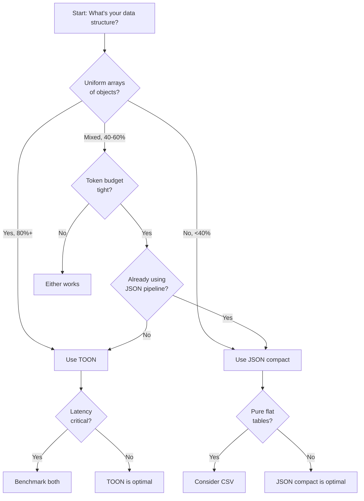

# When to Use TOON

TOON excels in specific scenarios and falls short in others. This guide helps you choose the right format for your use case.

## TOON's Sweet Spot

TOON achieves maximum efficiency with **uniform arrays of objects**—data with the same structure across items:

```yaml
employees[100]{id,name,email,department,salary,yearsExperience,active}:
  1,Alice Johnson,alice@example.com,Engineering,95000,5,true
  2,Bob Smith,bob@example.com,Sales,72000,3,true
  3,Carol White,carol@example.com,Engineering,88000,7,false
  # ... 97 more rows
```

<CardGroup cols={2}>
  <Card title="Uniform Structure" icon="table">
    All objects have identical fields with primitive values—perfect for tabular format
  </Card>
  <Card title="Token Efficiency" icon="compress">
    Field names declared once instead of repeated 100 times—massive token savings
  </Card>
  <Card title="LLM Validation" icon="shield-check">
    `[100]` length and `{fields}` header help models detect truncation and validate structure
  </Card>
  <Card title="CSV-like Compactness" icon="chart-line">
    Approaches CSV efficiency while remaining fully lossless JSON
  </Card>
</CardGroup>

## Ideal Use Cases

### 1. Tabular Data for LLMs

When sending structured data to LLMs for analysis, search, or question-answering:

<Accordion title="Analytics Data">
  ```yaml
  metrics[60]{date,views,clicks,conversions,revenue,bounceRate}:
    2025-01-01,6138,174,12,2712.49,0.35
    2025-01-02,4616,274,34,9156.29,0.56
    2025-01-03,4460,143,8,1317.98,0.59
    # ... 57 more rows
  ```

  **Token savings**: 59.0% reduction vs JSON (9,115 tokens vs 22,245 tokens)

  **Benefits:**
  - LLMs can easily aggregate metrics (sum revenue, count high-bounce days)
  - `[60]` length enables "How many days?" queries without counting
  - Tabular format improves parsing accuracy for numeric operations
</Accordion>

<Accordion title="Database Query Results">
  ```yaml
  users[250]{id,username,email,createdAt,lastLogin,status}:
    1,alice_j,alice@example.com,2023-01-15T10:30:00Z,2025-03-05T14:22:00Z,active
    2,bob_smith,bob@example.com,2023-02-20T08:15:00Z,2025-03-06T09:10:00Z,active
    # ... 248 more rows
  ```

  **Use case**: Sending query results to LLMs for data analysis

  **Benefits:**
  - Massive token reduction for large result sets
  - Preserves type information (timestamps, booleans, nulls)
  - Array length helps models understand dataset size
</Accordion>

<Accordion title="API Responses">
  ```yaml
  repositories[100]{id,name,stars,watchers,forks,language,updatedAt}:
    28457823,freeCodeCamp,430886,8583,42146,JavaScript,2025-10-28T11:58:08Z
    132750724,build-your-own-x,430877,6332,40453,null,2025-10-28T12:37:11Z
    # ... 98 more rows
  ```

  **Token savings**: 42.3% reduction vs JSON (8,744 tokens vs 15,144 tokens)

  **Benefits:**
  - Compact representation of API paginated results
  - Handles mixed data types (numbers, strings, null)
  - Easy for LLMs to answer comparative queries ("Which repo has most stars?")
</Accordion>

### 2. Mixed-Structure Documents

Data with both nested objects and tabular arrays:

```yaml
context:
  task: Our favorite hikes together
  location: Boulder
  season: spring_2025
friends[3]: ana,luis,sam
hikes[3]{id,name,distanceKm,elevationGain,companion,wasSunny}:
  1,Blue Lake Trail,7.5,320,ana,true
  2,Ridge Overlook,9.2,540,luis,false
  3,Wildflower Loop,5.1,180,sam,true
```

<Info>
  **Format flexibility**: TOON automatically chooses the most efficient representation for each data structure—YAML-style indentation for objects, inline for primitive arrays, tabular for uniform object arrays.
</Info>

### 3. LLM-Generated Structured Output

When asking LLMs to generate structured data:

<Accordion title="Why TOON Helps">
  1. **Explicit structure**: `[N]` lengths and `{fields}` headers guide model output
  2. **Validation**: You can detect truncation by checking actual vs declared array length
  3. **Parsing reliability**: Tabular format reduces ambiguity compared to freeform JSON
  4. **Token efficiency**: Models generate fewer tokens for the same information

  **Example prompt:**
  ```
  Generate a list of 5 book recommendations in TOON format:

  books[5]{title,author,year,genre,rating}:
  ```

  The format header serves as both instruction and schema.
</Accordion>

### 4. RAG (Retrieval-Augmented Generation)

For retrieval systems that inject data into prompts:

- **Token budget optimization**: More data fits in context window
- **Structure preservation**: Full JSON data model support
- **LLM comprehension**: 76.4% accuracy vs JSON's 75.0% in benchmarks

## When NOT to Use TOON

TOON is not always the best choice. Consider alternatives in these scenarios:

### 1. Deeply Nested or Non-Uniform Structures

<Warning>
  **Problem**: Data with minimal tabular eligibility (≈0%) often uses **more tokens** in TOON than compact JSON.
</Warning>

<Accordion title="Example: Deeply Nested Config">
  ```json
  {
    "server": {
      "http": {
        "port": 8080,
        "timeout": 30,
        "cors": {
          "enabled": true,
          "origins": ["*"]
        }
      },
      "database": {
        "primary": {
          "host": "localhost",
          "port": 5432
        }
      }
    }
  }
  ```

  **Token comparison** (from benchmarks):
  - **JSON compact**: 558 tokens
  - **TOON**: 620 tokens (+11.1%)
  - **JSON pretty**: 911 tokens

  **Recommendation**: Use **JSON compact** for deeply nested configuration objects.
</Accordion>

<Accordion title="When This Happens">
  - Complex configuration files with many nested levels
  - Tree structures (file systems, org charts)
  - Recursive data structures
  - Objects with highly variable field sets

  **Rule of thumb**: If tabular eligibility is near 0%, try JSON compact first.
</Accordion>

### 2. Semi-Uniform Arrays

<Warning>
  **Problem**: Arrays with ~40–60% tabular eligibility show diminishing returns. Token savings may not justify switching formats.
</Warning>

<Accordion title="Example: Event Logs with Mixed Structure">
  ```yaml
  events[4]:
    - timestamp: 2025-03-06T10:30:00Z
      type: login
      userId: 123
    - timestamp: 2025-03-06T10:31:00Z
      type: error
      message: Connection timeout
      error:
        code: ETIMEOUT
        stack: ...
    - timestamp: 2025-03-06T10:32:00Z
      type: login
      userId: 456
    - timestamp: 2025-03-06T10:33:00Z
      type: pageview
      path: /dashboard
      referrer: null
  ```

  **Token comparison** (from benchmarks):
  - **JSON compact**: 128,529 tokens
  - **TOON**: 154,084 tokens (+19.9%)

  Half the events are simple, half have nested errors—TOON can't use tabular format, so list format adds overhead.

  **Recommendation**: Use **JSON compact** when uniformity is below ~60%.
</Accordion>

### 3. Pure Tabular Data (CSV Territory)

<Info>
  **Context**: CSV is **smaller** than TOON for flat tables. TOON adds ~5-10% overhead for structural features that improve LLM reliability.
</Info>

<Accordion title="Token Comparison: Employee Records">
  **CSV** (47,102 tokens):
  ```csv
  id,name,email,department,salary,yearsExperience,active
  1,Alice Johnson,alice@example.com,Engineering,95000,5,true
  2,Bob Smith,bob@example.com,Sales,72000,3,true
  # ... 98 more rows
  ```

  **TOON** (49,919 tokens, +6.0%):
  ```yaml
  employees[100]{id,name,email,department,salary,yearsExperience,active}:
    1,Alice Johnson,alice@example.com,Engineering,95000,5,true
    2,Bob Smith,bob@example.com,Sales,72000,3,true
    # ... 98 more rows
  ```

  **What TOON adds:**
  - Array length declaration: `[100]`
  - Key prefix: `employees`
  - Delimiter scoping in header

  **When to choose CSV:**
  - Pure tabular data with no nesting
  - Token budget is extremely tight
  - LLMs already understand your CSV schema

  **When to choose TOON:**
  - Need structural validation (`[N]` length checking)
  - Data includes nested objects or multiple arrays
  - Want lossless JSON compatibility
</Accordion>

### 4. Latency-Critical Applications

<Warning>
  **Problem**: Some model deployments (especially local/quantized models like Ollama) may process compact JSON **faster** than TOON despite lower token counts.
</Warning>

<Accordion title="Factors Affecting Latency">
  **Time-to-First-Token (TTFT):**
  - TOON's lower token count may not always mean faster TTFT
  - Model tokenizer efficiency varies by format
  - Local models may optimize for common JSON patterns

  **Tokens per Second (t/s):**
  - Generation speed depends on model implementation
  - Some models may parse JSON more efficiently

  **Total Time:**
  - `total = TTFT + (tokens / t/s)`
  - Measure both components for your exact setup

  **Recommendation**: **Benchmark on your actual deployment**—measure TTFT, t/s, and total time for both formats and use whichever is faster.
</Accordion>

<Accordion title="When Latency Matters Most">
  - Real-time user-facing applications
  - High-throughput batch processing
  - Edge deployments with constrained resources
  - Applications where milliseconds count (trading, monitoring)

  **Action items:**
  1. Profile both TOON and JSON compact in your environment
  2. Test with representative data samples
  3. Measure across different model sizes/quantization levels
  4. Choose the format that performs better **for your specific setup**
</Accordion>

## Decision Framework

Use this flowchart to choose the right format:



## Tabular Eligibility

**Tabular eligibility** measures what percentage of your data can use TOON's efficient tabular format:

<CardGroup cols={2}>
  <Card title="100% Eligible" icon="check">
    All arrays are uniform objects with primitive values—maximum token savings
  </Card>
  <Card title="60-80% Eligible" icon="circle-check">
    Most arrays are tabular—significant token savings
  </Card>
  <Card title="40-60% Eligible" icon="circle-half-stroke">
    Mixed structure—modest token savings, evaluate tradeoffs
  </Card>
  <Card title="0-40% Eligible" icon="xmark">
    Minimal tabular data—JSON compact likely more efficient
  </Card>
</CardGroup>

<Accordion title="Calculating Eligibility">
  An array is **tabular-eligible** when:
  1. All elements are objects
  2. All objects have identical field sets
  3. All values are primitives (no nested objects/arrays)

  **Calculate for your dataset:**
  ```typescript
  eligibleArrays / totalArrays = tabularEligibility
  ```

  **Example:**
  - 5 arrays total
  - 3 are tabular-eligible
  - Eligibility = 3/5 = 60%

  **Benchmark results show:**
  - **100% eligibility**: ~60% token reduction vs JSON
  - **50% eligibility**: ~15% token reduction vs JSON
  - **0% eligibility**: +10% tokens vs JSON compact (overhead from structure)
</Accordion>

## Real-World Benchmarks

### Token Efficiency by Structure

From TOON's comprehensive benchmarks:

| Dataset | Structure | Eligibility | TOON vs JSON | TOON vs JSON Compact |
|---------|-----------|-------------|--------------|----------------------|
| Employee records | Uniform | 100% | **−60.7%** | −36.9% |
| Time-series analytics | Uniform | 100% | **−59.0%** | −35.9% |
| GitHub repositories | Uniform | 100% | **−42.3%** | −23.7% |
| E-commerce orders | Nested | 33% | **−33.3%** | +5.3% |
| Event logs | Semi-uniform | 50% | **−15.0%** | +19.9% |
| Nested config | Deep | 0% | **−31.9%** | +11.1% |

<Tip>
  **Key insight**: TOON excels at 80%+ tabular eligibility, becomes marginal at 40-60%, and may add overhead below 40%.
</Tip>

### Accuracy Comparison

LLM retrieval accuracy across 209 questions on 4 models:

```
TOON           76.4% accuracy  │  2,759 tokens  │  27.7 acc%/1K tok
JSON           75.0% accuracy  │  4,587 tokens  │  16.4 acc%/1K tok
JSON compact   73.7% accuracy  │  3,104 tokens  │  23.7 acc%/1K tok
YAML           74.5% accuracy  │  3,749 tokens  │  19.9 acc%/1K tok
```

<Info>
  TOON achieves **slightly better accuracy** (76.4% vs 75.0%) while using **39.9% fewer tokens** than JSON.
</Info>

## Quick Reference

<CardGroup cols={2}>
  <Card title="Use TOON When..." icon="circle-check">
    - Uniform arrays of objects (80%+ tabular eligibility)
    - Sending structured data to LLMs
    - Token budget is a concern
    - Need validation guardrails (`[N]` lengths, `{fields}` headers)
    - Want lossless JSON compatibility with better efficiency
  </Card>
  
  <Card title="Use JSON Compact When..." icon="code">
    - Deeply nested structures (0-40% tabular eligibility)
    - Non-uniform data with variable fields
    - Already have JSON pipelines
    - Latency benchmarks favor JSON in your environment
  </Card>
  
  <Card title="Use CSV When..." icon="table">
    - Pure flat tables with no nesting
    - Token budget is extremely tight
    - Don't need structural validation
    - LLMs already understand your CSV schema
  </Card>
  
  <Card title="Benchmark When..." icon="chart-bar">
    - Latency is critical
    - Tabular eligibility is 40-60% (marginal case)
    - Deploying to local/quantized models
    - Unsure which format fits your use case
  </Card>
</CardGroup>

## Try It Yourself

<CardGroup cols={3}>
  <Card title="Playground" icon="play" href="/playground">
    Convert your JSON to TOON and compare token counts
  </Card>
  
  <Card title="Benchmarks" icon="chart-line" href="/advanced/benchmarks">
    See detailed comparisons across data structures
  </Card>
  
  <Card title="Quick Start" icon="rocket" href="/quickstart">
    Install the library and test with your data
  </Card>
</CardGroup>

<Tip>
  Still unsure? Start with the [playground](https://toonformat.dev/playground) to see token counts for your actual data, then consult the [benchmarks](/advanced/benchmarks) for detailed performance analysis.
</Tip>